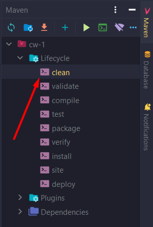

# Controll work - 1

## How to Install and Run the Project
1. Clone repo to your local machine
2. Open project with IntelliJ IDEA 
3. Configure Apache Tomcat v9.0.65
4. Download all dependencies in `pom.xml`
5. Run application

## Technologies
Application based on Spring Framework v5.3.23
### **Web**
* Apache Tomcat v9.0.65
* Spring MVC
### **Database**
* Text files is used instead of RDB
### **Enviroments**
* IntelliJ IDEA
### **Others**
* Apache Maven as application builder

## Project structure
It is a simple Spring MVC based CRUD application with structure:
* `ua.com.drabchak.demo.model.*` - model
* `ua.com.drabchak.demo.repository.*` - repository layer
* `ua.com.drabchak.demo.service.*` - service
* `ua.com.drabchak.demo.util.*` - util directory, which contains all useful classes for application

## Application features
* `http://localhost:8080` - url that forwards user to starting page
* `http://localhost:8080/manufacturers` - this url forwards user to list of all available manufacturers
* `http://localhost:8080/souvenirs` - this one forwards user to list of all available souvenirs
* `http://localhost:8080/utils` - this url forwards user to all advanced operations with records 

## UPD
1. When you launch the application for the first time, a target folder will be created in the project root.
The data files will be stored in target/cw-1/WEB-INF/classes/repo. After running the program, all the data you entered will be saved in the repository. 
If you need to reset the data storage, run the following command:

2. If you don't see any changes after deleting, adding, or editing a record, try reloading the current page. 
This might happen because the file is being used as a data storage instead of a database, and it may take some time before the changes are applied.
